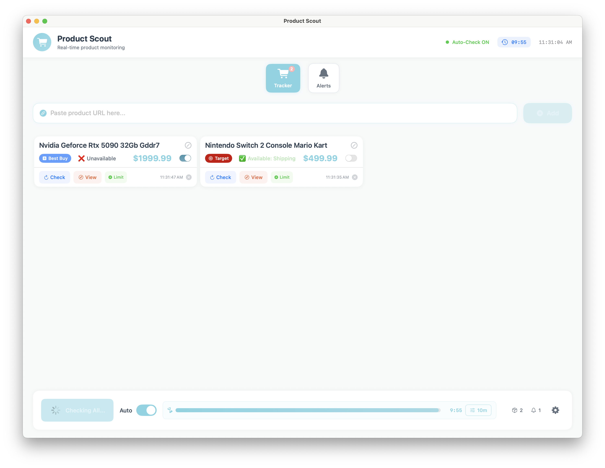

# ProductScout - Native macOS Stock Tracker for Multiple Retailers

🔍 Scout for products across multiple retailers. An independent, beautiful native macOS availability tracker with price alerts, auto-refresh, and instant notifications. Built with Swift and SwiftUI for optimal performance and seamless macOS integration.

## 📥 Quick Download

**[⬇️ Download ProductScout.app (Latest Release)](https://github.com/WtSg/ProductScout/releases/latest)**

Just download, unzip, and drag to your Applications folder! No compilation needed.

*First time running? Right-click ProductScout.app and select "Open" to bypass macOS Gatekeeper.*



## ✨ Features

- **🔍 Real-time Monitoring** - Track product availability with customizable auto-check intervals
- **🏪 Multi-Retailer Support** - Works with Best Buy, Target, Canon, Ricoh/Pentax, and more coming soon
- **💰 Price Limit Alerts** - Get notified only when products are available at or below your target price
- **🔔 Smart Notifications** - Native macOS notifications when products become available
- **🎨 Beautiful Interface** - Modern SwiftUI design with automatic light/dark mode support
- **⚡ Native Performance** - Pure Swift implementation, no Python or external dependencies required
- **🎯 Custom Product Names** - Rename products for easy identification
- **📊 Visual Feedback** - Progress bars and status indicators for monitoring state

## 📋 Requirements

- macOS 12.0 (Monterey) or later
- Xcode Command Line Tools
- Swift 5.5+

## 🚀 Installation

### Quick Start

1. Clone the repository:
```bash
git clone https://github.com/yourusername/ProductScout.git
cd ProductScout
```

2. Run the build script:
```bash
./build_and_run.sh
```

The app will build and launch automatically!

### Manual Build

If you prefer to build manually:

```bash
# Build in release mode
swift build -c release

# Run the app
.build/release/Tracker
```

### Creating an App Bundle

The build script automatically creates a `.app` bundle that you can drag to your Applications folder.

## 📖 Usage

1. **Launch the App** - Double-click ProductScout.app or run from terminal
2. **Add Products** - Paste product URLs from supported retailers
3. **Set Custom Names** - Click the pencil icon to rename products
4. **Configure Price Limits** - Set maximum prices for notifications
5. **Enable Auto-Check** - Toggle automatic monitoring with your preferred interval
6. **Receive Alerts** - Get notified when products become available

### Keyboard Shortcuts

- `⌘Q` - Quit
- `⌘,` - Preferences (coming soon)

### Right-Click Context Menu

Right-click on any product card for quick actions:
- Check Now
- View on Website
- Copy URL
- Edit Name
- Set Price Limit
- Toggle Notifications
- Duplicate
- Delete

## 🏪 Supported Retailers

*Note: This is an independent tool. We are not affiliated with any of these retailers.*

| Retailer | Status | Notes |
|----------|--------|-------|
| Best Buy | ✅ Full Support | US & Canada |
| Target | ✅ Full Support | US stores |
| Canon | ✅ Full Support | Official Canon store |
| Ricoh/Pentax | ✅ Full Support | Ricoh Imaging store |
| Amazon | 🚧 Coming Soon | In development |
| Walmart | 🚧 Coming Soon | Planned |

## 🛠️ Building from Source

### Prerequisites

Install Xcode Command Line Tools if you haven't already:
```bash
xcode-select --install
```

### Build Steps

1. Clone the repository
2. Navigate to the TrackerApp directory
3. Build the project:
```bash
swift build -c release
```

### Running Tests

```bash
swift test
```

## 🤝 Contributing

Contributions are welcome! Here's how you can help:

1. Fork the repository
2. Create a feature branch (`git checkout -b feature/amazing-feature`)
3. Commit your changes (`git commit -m 'Add amazing feature'`)
4. Push to the branch (`git push origin feature/amazing-feature`)
5. Open a Pull Request

### Adding New Retailers

To add support for a new retailer:

1. Add the retailer to `SupportedWebsite` enum in `WebsiteDetector.swift`
2. Create a new scraper class implementing the `ProductScraper` protocol
3. Register the scraper in `ScraperFactory.swift`
4. Add detection logic in `WebsiteDetector.swift`

## 📝 License

This project is licensed under the MIT License - see the [LICENSE](LICENSE) file for details.

## ⚖️ Legal Disclaimer

This application is an independent tool and is not affiliated with, endorsed by, or sponsored by Best Buy Co. Inc., Target Corporation, Canon Inc., Ricoh Company Ltd., or any other retailer mentioned. 

All trademarks, service marks, trade names, product names, logos, and brands are the property of their respective owners. Use of these names, logos, and brands does not imply endorsement. All company, product, and service names used in this application are for identification purposes only.

This tool accesses publicly available information and is intended for personal use. Users are responsible for complying with each retailer's terms of service.

## 🙏 Acknowledgments

- Built with [SwiftSoup](https://github.com/scinfu/SwiftSoup) for HTML parsing
- Icon design inspired by macOS Big Sur aesthetic
- Thanks to all contributors and testers

## 📞 Support

If you encounter any issues or have feature requests, please:
1. Check the [Issues](https://github.com/WtSg/ProductScout/issues) page
2. Create a new issue if your problem isn't already listed
3. Provide as much detail as possible

## 🗺️ Roadmap

- [ ] Amazon support
- [ ] Walmart support
- [ ] Price history tracking
- [ ] Export/import product lists
- [ ] Multiple notification channels (Discord, Slack)
- [ ] iOS companion app
- [ ] Product categories and organization
- [ ] Advanced filtering options

## 💖 Support This Project

If you find ProductScout helpful and want to support its development, consider buying me a coffee!

[](https://paypal.me/WtSg)

---

Made with ❤️ for the macOS community